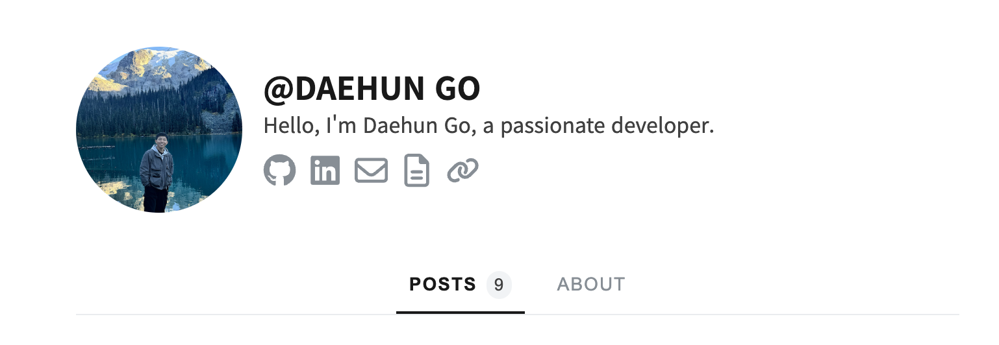

 
 

## Why Did I start new blog?

I decided to start this new blog to record what I study and learn everyday.  
Whenever I learn something new, I tend to forget it quickly unless I write it down.

That's why I'm starting this blog! Through this blog, I plan to share what I study, things I discover, and even algorithm logic I work on. Especially, I'll write all my posts in English! This way, I can improve my English writing skills.

Actually I've done something similar before using a platform called ` velog`.  
However, one day I saw many developers running their own customized blogs, and I was really impressed. As a developer, I feel like having a personal website that I can customize to my taste.

So, I decided to create my own blog using `Github Page`  
From now on, I'll use this blog to consistently record what I learn every day!

 

## What is Github Page?

Github Page is a free static web hosting service. It creates static websites based on `Github Repository Files` and then hosts them online.

Especially, if you activate `Pages Option` in your Github Repository settings, you don't have to worry about deploying the website. It's really easy to deploy your own website. The only thing you need to care about is choosing a good template and making your website beautiful.

Furthermore, you can add a `comments system` to your website by using 3rd-party libraries like `giscus`. This library implements a `comments system` using your Github repository's `discussions` feature, which I found really fascinating.

I hope to write a more detailed post about this in the future!

 

## So, Which Template Did I Choose?

I spent quite some time searching through various templates to create a beautiful blog. But It was hard to find a template that I really liked
Then, I found [gatsby-starter-hoodie](https://github.com/devHudi/gatsby-starter-hoodie), and it was exactly what I was looking for!

The template has a clean and minimal design with useful features like series and tags, which is exactly what I wanted. The template was created by the `hoodie` developer. I really appreciate him for making the template so easy to use.

It seems to be based on Gatsby, but I haven't looked into it in detail yet. I plan to study and write posts about this part as well.

 

## Future Plans

I plan to consistently record new things I learn while studying development on this blog so I don't forget them. And later, if someone asks me "How did you study?", I'll be proud to show them this blog.

I'll do my best to post regularly! 😊
